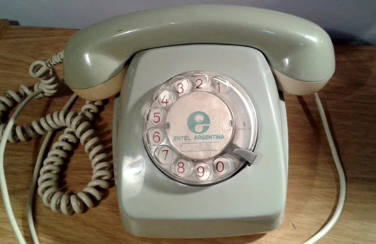

# La peor interfaz del mundo.

José Luis Díaz - CEIA - A2114 - diazjoseluis@gmail.com

## Descripción

Impulsado un poco por la nostalgia, decidí hacer un viejo disco de teléfono para ingresar un número de teléfono. Con un pequeño cambio: para borrar un número también es necesario discar.

Intenté hacerlo con ChatGPT, pero no quiso cargar y tuve algunos problemas con Canvas las dos veces que intenté utilizarlo. Decidí usar el Canvas de Gemini y tuve mejores resultados.

## Entregables

- [App](https://joseluisdiaz.github.io/CEIA-LLMIAG-tp/entrega1/) - [Codigo](index.html) - La app con la peor interface del mundo.
- [Prompts](prompts.md) - Secuencia de prompts 